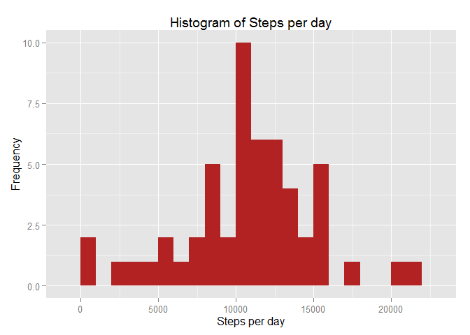
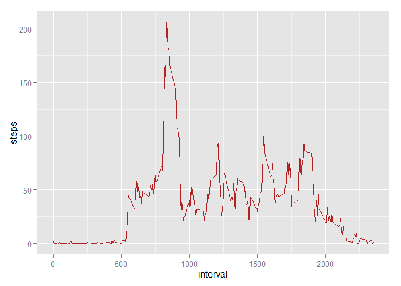
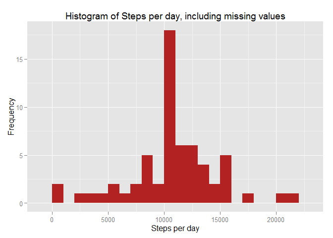

# AssignmentCourseProject 1
Sunil Gurusiddappa  
January 20, 2016  

This is an R Markdown document. Markdown is a simple formatting syntax for authoring HTML, PDF, and MS Word documents. For more details on using R Markdown see <http://rmarkdown.rstudio.com>.

When you click the **Knit** button a document will be generated that includes both content as well as the output of any embedded R code chunks within the document. You can embed an R code chunk like this:

Load the packages needed

```r
#install.packages('knitr')
library(knitr)
```

```
## Warning: package 'knitr' was built under R version 3.2.3
```

```r
opts_chunk$set(echo = TRUE)
#install.packages('dplyr')
library(dplyr)
```

```
## 
## Attaching package: 'dplyr'
```

```
## The following objects are masked from 'package:stats':
## 
##     filter, lag
```

```
## The following objects are masked from 'package:base':
## 
##     intersect, setdiff, setequal, union
```

```r
library(lubridate)
library(ggplot2)
```
Loading and preprocessing the data
Assumption: The data is downloaded and extracted to the working directory
 

```r
if ( !file.exists( "data" ) ) {
  dir.create( "data" )
}
url <- "https://d396qusza40orc.cloudfront.net/repdata%2Fdata%2Factivity.zip"
destfile <- "./data/repdata_data_activity.zip"
download.file(url=url, destfile=destfile,mode="wb")
unzip (destfile, exdir = "./data")
 
data <- read.csv("./data/activity.csv", header = TRUE, sep = ',', colClasses = c("numeric", "character","integer"))
```
Process/transform the data (if necessary) into a format suitable for your analysis

```r
data$date <- ymd(data$date)
```
What is mean total number of steps taken per day?
For this part of the assignment, you can ignore the missing values in the dataset.
1.Calculate the total number of steps taken per day
2.Make a histogram of the total number of steps taken each day
3.Calculate and report the mean and median of the total number of steps taken per day


```r
steps <- data %>%  filter(!is.na(steps)) %>%  group_by(date) %>%  summarize(steps = sum(steps))

ggplot(steps, aes(x = steps)) +  geom_histogram(fill = "firebrick", binwidth = 1000) + labs(title = "Histogram of Steps per day", x = "Steps per day", y = "Frequency")
```

\

```r
mean_steps <- mean(steps$steps, na.rm = TRUE)
mean_steps
```

```
## [1] 10766.19
```

```r
median_steps <- median(steps$steps, na.rm = TRUE)
median_steps
```

```
## [1] 10765
```

What is the average daily activity pattern?
a.Make a time series plot (i.e. type = "l") of the 5-minute interval (x-axis) and the average number of steps taken, averaged across all days (y-axis)
b.Which 5-minute interval, on average across all the days in the dataset, contains the maximum number of steps?


```r
interval <- data %>%  filter(!is.na(steps)) %>%  group_by(interval) %>%  summarize(steps = mean(steps))

ggplot(interval, aes(x=interval, y=steps)) +  geom_line(color = "firebrick")
```

\

```r
interval[which.max(interval$steps),]
```

```
## Source: local data frame [1 x 2]
## 
##   interval    steps
##      (int)    (dbl)
## 1      835 206.1698
```
Imputing missing values
1.Calculate and report the total number of missing values in the dataset (i.e. the total number of rows with NAs)
2.Devise a strategy for filling in all of the missing values in the dataset. The strategy does not need to be sophisticated. For example, you could use the mean/median for that day, or the mean for that 5-minute interval, etc.
3.Create a new dataset that is equal to the original dataset but with the missing data filled in.
4.Make a histogram of the total number of steps taken each day and Calculate and report the mean and median total number of steps taken per day. Do these values differ from the estimates from the first part of the assignment? What is the impact of imputing missing data on the estimates of the total daily number of steps?

```r
sum(is.na(data$steps))
```

```
## [1] 2304
```

```r
data_full <- data
nas <- is.na(data_full$steps)
avg_interval <- tapply(data_full$steps, data_full$interval, mean, na.rm=TRUE, simplify=TRUE)
data_full$steps[nas] <- avg_interval[as.character(data_full$interval[nas])]
sum(is.na(data_full$steps))
```

```
## [1] 0
```

```r
steps_full <- data_full %>%  filter(!is.na(steps)) %>%  group_by(date) %>%  summarize(steps = sum(steps)) %>%  print
```

```
## Source: local data frame [61 x 2]
## 
##          date    steps
##        (time)    (dbl)
## 1  2012-10-01 10766.19
## 2  2012-10-02   126.00
## 3  2012-10-03 11352.00
## 4  2012-10-04 12116.00
## 5  2012-10-05 13294.00
## 6  2012-10-06 15420.00
## 7  2012-10-07 11015.00
## 8  2012-10-08 10766.19
## 9  2012-10-09 12811.00
## 10 2012-10-10  9900.00
## ..        ...      ...
```

```r
ggplot(steps_full, aes(x = steps)) +  geom_histogram(fill = "firebrick", binwidth = 1000) +  labs(title = "Histogram of Steps per day, including missing values", x = "Steps per day", y = "Frequency")
```

\

```r
mean_steps_full <- mean(steps_full$steps, na.rm = TRUE)
median_steps_full <- median(steps_full$steps, na.rm = TRUE)
mean_steps_full
```

```
## [1] 10766.19
```

```r
median_steps_full
```

```
## [1] 10766.19
```
Are there differences in activity patterns between weekdays and weekends?
1.	Create a new factor variable in the dataset with two levels - "weekday" and "weekend" indicating whether a given date is a weekday or weekend day.
2.	Make a panel plot containing a time series plot (i.e. type = "l") of the 5-minute interval (x-axis) and the average number of steps taken, averaged across all weekday days or weekend days (y-axis).

```r
data_full <- mutate(data_full, weektype = ifelse(weekdays(data_full$date) == "Saturday" | weekdays(data_full$date) == "Sunday", "weekend", "weekday"))
data_full$weektype <- as.factor(data_full$weektype)

interval_full <- data_full %>%   group_by(interval, weektype) %>%  summarise(steps = mean(steps)) 

s <- ggplot(interval_full, aes(x=interval, y=steps, color = weektype)) +  geom_line() +  facet_wrap(~weektype, ncol = 1, nrow=2)
print(s)
```

\

